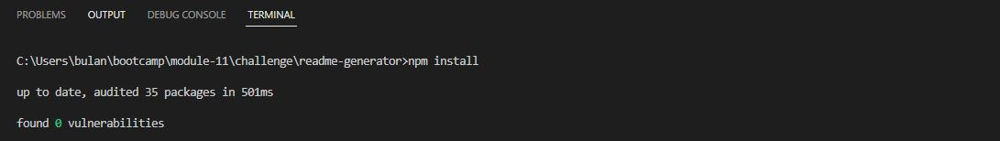
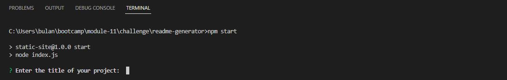
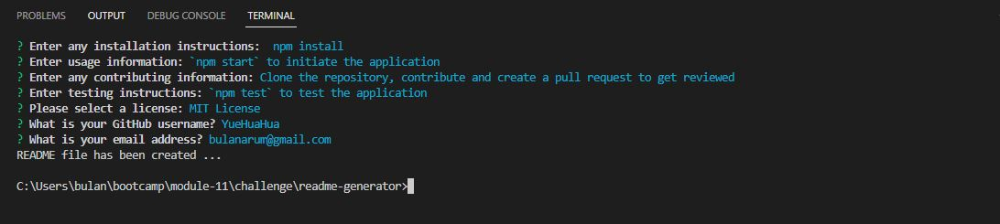
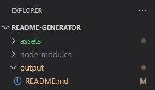

# README Generator

 
  
## Table of Contents

- [Description](#description)
- [Installation](#installation)
- [Usage](#usage)
- [License](#license)
- [Contributing](#contributing)
- [Tests](#tests)
- [Questions](#questions)

 

## Description

This application is a command-line application that dynamically generates a professional README.md file from a user’s input by using JavaScript, Node, and the Inquirer package. This README was created with the application!

 

## Installation

To install the needed packages, run the following command in the application: `npm install`

 

## Usage

Download the file from repo to your machine. Go into the file directory in the terminal and start the application by typing `npm start` command. Answer each question required to create the README, and your file will be generated in the `output` folder on your machine. Watch this 📽 [video](assets/images/file.mov) to see the demo.

1. `npm install` to download the required packages.

2. `npm start` to initiate the application.

3. Answer prompts in the terminal

4. Check the freshly generated `README.md` file in the `output` folder. Click [here](./output/README.md) to check the result.

 

## License

Licensed under the MIT License. Click the license's badge for the full details. 

 

## Contributing

Please take a look at our contributing guidelines below if you're interested in helping!

1. Clone the project onto your machine
2. Contribute and make a pull request to be reviewed.

 

## Tests

N/A

## Questions

If you have any questions regarding this application, feel free to send me an email at [bulanarum@gmail.com](mailto:bulanarum@gmail.com).

 

Created by [YueHuaHua](https://github.com/YueHuaHua).
